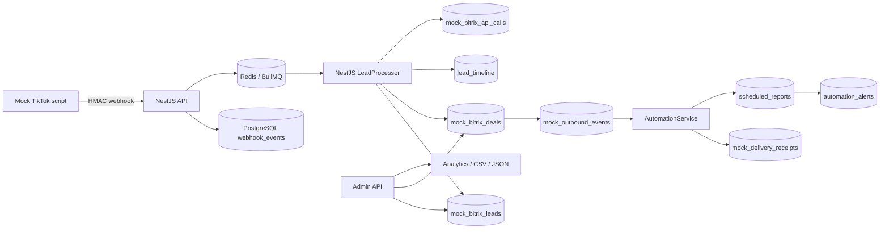
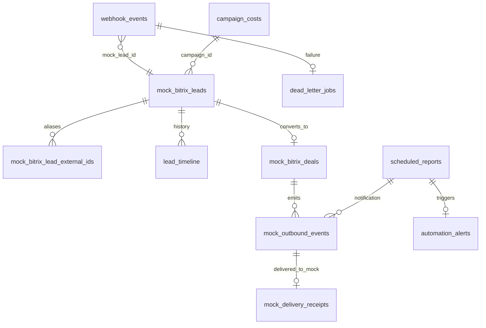

# Kiến trúc bản demo mock

Đây là mô hình **mock**, không có token TikTok/Bitrix24 thật. `event_id` chống gửi lại cùng sự kiện; alias TikTok `lead_id`, email và điện thoại chuẩn hóa chống tạo trùng khách hàng. Worker cập nhật Lead, Deal và trạng thái sự kiện trong một transaction PostgreSQL. Redis giữ queue; `dead_letter_jobs` lưu lỗi cuối cùng để kiểm tra/replay. HTTP 202 chỉ xác nhận đã lưu và xếp hàng, không khẳng định đồng bộ thành công.

Rule tự động tạo tối đa một Deal cho mỗi Lead khi tên campaign (hoặc campaign ID nếu thiếu tên) chứa chuỗi cấu hình. Rule cũng xét campaign/city để gán sales và cộng xác suất theo form/interaction. `customFields` mock được lưu JSONB, không phải field ID thực từ Bitrix24. `AutomationService` quét outbound 5 giây/lần với khóa row `SKIP LOCKED`, retry tối đa 3 lần và lưu receipt ở **đích giả lập**. Snapshot theo giờ UTC được chống lặp bằng unique `period_start`; alert low-conversion được gửi inbox mock. Admin dùng `x-admin-key` hoặc session Redis 8 giờ. Trước production cần OAuth/secret manager, xác minh webhook chính thức, TLS, phân quyền chi tiết, idempotency callback Bitrix24 và quan sát vận hành.

Admin DELETE Lead/Deal là archive mềm (`archived_at`), không xóa audit. Các danh sách/analytics bỏ qua bản ghi archived; webhook mới có thể kích hoạt lại Lead cùng danh tính. CRM production cần chính sách retention và quyền xóa riêng.
